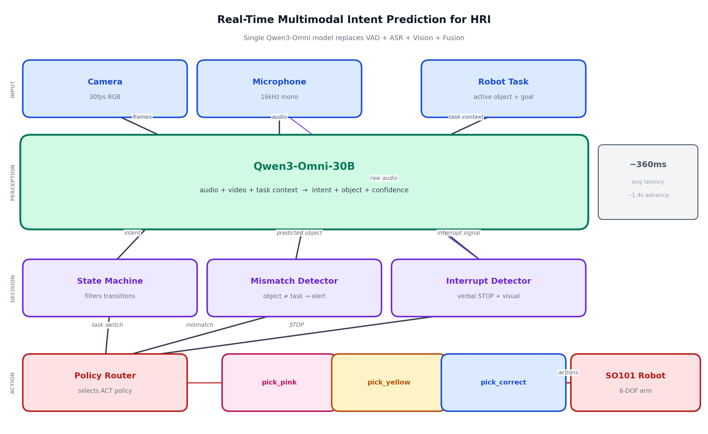

# Qwen-HRI-Intent

Real-time multimodal intent prediction for Human-Robot Interaction using **Qwen3-Omni-30B**.

A single unified model (Qwen3-Omni) replaces what would normally be VAD + ASR + Vision + Fusion pipeline. The model sees, hears, and understands simultaneously, predicting human intent in the next 1-2 seconds and firing interrupts to the robot when intent diverges from the active task.

## System Architecture



**Two-machine setup:**
- **GPU Server** (s99) — runs vLLM with Qwen3-Omni-30B (2x RTX PRO 6000, 192GB VRAM)
- **Robot Laptop** (gqu6x) — runs prediction + robot control (RTX 4070)

## Features

- **Single multimodal model** — Qwen3-Omni processes audio + video in one unified call (~360ms)
- **Voice-first interaction** — speak "pick up the yellow ball" to start, "no, the pink one" to switch
- **Real-time interrupt detection** — verbal STOP, visual mismatch, trajectory change
- **Policy switching** — 3 ACT policies for SO101 robot (pink ball, yellow ball, pick-and-correct)
- **State machine filtering** — enforces valid intent transitions, reduces false positives to 0
- **Color-aware object tracking** — Qwen outputs "blue bottle", "black headphones" (not generic labels)
- **Graceful audio degradation** — retries video-only when audio interference occurs

## Intent Classes

`approach` | `gesture` | `withdraw` | `continue` | `point` | `change_target` | `interrupt` | `new_command` | `unknown`

## Performance (v3)

| Metric | Value |
|--------|-------|
| Avg latency | **360ms** |
| False positives | **0** |
| Unknown predictions | 1.7% |
| Verbal interrupt detection | 100% |
| Advance prediction time | ~1.4s |

## Quick Start

### 1. Start vLLM on GPU server (s99)

```bash
VLLM_V1_ENABLED=0 vllm serve "Qwen/Qwen3-Omni-30B-A3B-Instruct" \
    --api-key vllm-omni --host 0.0.0.0 --port 8000 \
    --tensor-parallel-size 2 --max-model-len 32768 \
    --gpu-memory-utilization 0.90 \
    --limit-mm-per-prompt '{"audio":1,"video":1,"image":1}' \
    --trust-remote-code --served-model-name "qwen3-30b-a3b" \
    --max-num-seqs 4
```

### 2. Run the system on robot laptop (gqu6x)

```bash
python run_system.py \
    --vllm-url http://<server-ip>:8000/v1 \
    --robot-port /dev/ttyACM1 \
    --camera-index 0 \
    --robot-camera-index 8
```

### 3. Speak commands

- "Pick up the yellow ball" — starts `pick_yellow_ball` ACT policy
- "No, the pink one" — interrupts and switches to `pick_pink_ball`
- "Stop" — halts the robot

## Offline Testing (no robot needed)

```bash
# Run interrupt test on a video file
python interrupt_test_runner.py \
    --video "video data/interrupt_test_take2.mp4" \
    --task "pick up the blue bottle" --task-object "blue bottle" \
    --inject-interrupt 10.0 "pick up the headphone" \
    --inject-interrupt 18.5 "pick up the blue bottle" \
    --inject-interrupt 21.0 "not this one, pick up the other bottle" \
    --output results/interrupt_test_v2.jsonl \
    --vllm-url http://<server-ip>:8000/v1

# Plot results
python plot_results.py

# Evaluate against ground truth
python compare_ground_truth.py results/predictions.jsonl sample_data/cleaning_ground_truth.json
```

## File Structure

```
qwen-hri-intent/
├── run_system.py                   # Main entry point (2-PC setup)
├── qwen_inference_engine.py        # Qwen3-Omni inference (Fast + Standard engines)
├── streaming_intent_predictor.py   # Streaming pipeline (motion gate, ring buffers)
├── interrupt_detection_system.py   # Interrupt detection (mismatch, audio, state machine)
├── interrupt_test_runner.py        # Offline test runner for video files
├── file_based_predictor.py         # CLI tool for video file prediction
├── compare_ground_truth.py         # Evaluation against ground truth
├── plot_results.py                 # Matplotlib visualization
├── system_architecture.py          # Architecture diagram generator
├── policy_router.py                # 3-PC setup policy router (legacy)
├── robot_server.py                 # 3-PC setup robot HTTP server (legacy)
├── act_training/
│   └── train_all_policies.sh       # ACT policy training script
├── sample_data/
│   └── cleaning_ground_truth.json  # Ground truth for evaluation
└── results/
    ├── system_architecture.png     # Architecture diagram
    ├── interrupt_results_v3.png    # Prediction vs ground truth plot
    └── interrupt_results_v3.pdf
```

## Trained ACT Policies

| Policy | Dataset | HuggingFace |
|--------|---------|-------------|
| pick_pink_ball | [so101-pink-cotton-ball-v1](https://huggingface.co/datasets/u539285g/so101-pink-cotton-ball-v1) | [tysyuvraj/so101-act-pick-pink-ball](https://huggingface.co/tysyuvraj/so101-act-pick-pink-ball) |
| pick_yellow_ball | [so101-yellow-cotton-ball-v1](https://huggingface.co/datasets/u539285g/so101-yellow-cotton-ball-v1) | [tysyuvraj/so101-act-pick-yellow-ball](https://huggingface.co/tysyuvraj/so101-act-pick-yellow-ball) |
| pick_and_correct | [so101-pick-up-interruption-v1](https://huggingface.co/datasets/u539285g/so101-pick-up-interruption-v1) | [tysyuvraj/so101-act-pick-and-correct](https://huggingface.co/tysyuvraj/so101-act-pick-and-correct) |

## Requirements

```
openai
opencv-python
numpy
matplotlib
sounddevice  # for microphone
```

vLLM server with Qwen3-Omni-30B requires ~60GB VRAM (2x GPU recommended).

## Robot-Agnostic Design

The Qwen prediction layer is robot-agnostic. To use with a different robot (e.g., Unitree G1 + GR00T N1.5):

1. Replace `RobotController` in `run_system.py` with your robot's API
2. Update the system prompt in `qwen_inference_engine.py`
3. Update the policy registry

The perception + interrupt detection pipeline stays the same.

## Citation

This work is part of a Master's thesis on real-time multimodal intent prediction for Human-Robot Interaction at Osaka University.

## License

MIT
