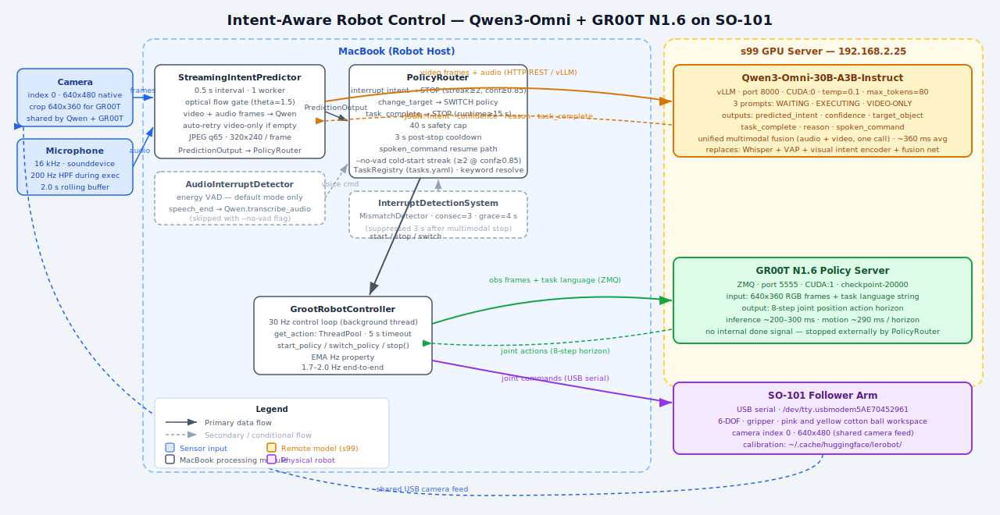

# Qwen-HRI-Intent

> **Master's Thesis** — Real-time Multimodal Intent Prediction for Human-Robot Interaction  
> Osaka University · 2026


A single unified model (**Qwen3-Omni-30B**) replaces an entire traditional pipeline — VAD + ASR + vision encoder + fusion network — by watching a live camera feed and listening to a microphone simultaneously, predicting what the human will do in the **next 1–2 seconds**, and firing interrupts to a **GR00T N1.6** robot policy in real time.

---

## System Diagram



---

## What It Does

When a GR00T policy is executing a pick-and-place task on an SO-101 robot arm, this system continuously asks: *"Is the human still okay with what the robot is doing?"* Every 500ms, Qwen3-Omni sees a frame + hears the last 2 seconds of audio and outputs:

| Field | Example |
|---|---|
| `predicted_intent` | `approach` / `withdraw` / `interrupt` / `change_target` |
| `confidence` | `0.91` |
| `target_object` | `"yellow cotton ball"` |
| `task_complete` | `true` |
| `reason` | `"Hand mid-motion toward yellow ball, audio 'stop' interrupts"` |

When intent diverges from the active task, a **STOP or switch signal** is fired to GR00T via ZMQ — no separate ASR or transcription pipeline needed during execution.

**Research contribution:** Qwen3-Omni serves as the unified multimodal backbone for continuous scene understanding AND in-task voice control. This replaces what would otherwise be Whisper + VAP + visual intent encoder + fusion network with a single model doing all the semantic work.

---

## Key Features

- **Unified multimodal model** — Qwen3-Omni processes audio + video in one call (~360ms avg)
- **No separate ASR** — in-task stops and switches extracted directly from `predicted_intent` field
- **`--no-vad` mode** — pure Qwen cold-start (no energy VAD at all); model acts as voice command detector
- **Three-tier auto-stop** — task_complete (visual), withdraw heuristic, runtime cap (40s)
- **High-pass filter** — 200Hz Butterworth HPF on predictor audio buffer suppresses motor noise during execution
- **HUD recording** — `--record` flag captures mp4 with live intent/confidence/Hz overlay
- **YAML task registry** — add new tasks without changing code
- **Graceful degradation** — retries video-only (`_FAST_PROMPT_VIDEO_ONLY`) when audio encoder degrades from noise

---

## Intent Classes

| Class | Meaning |
|---|---|
| `approach` | Human moving toward the robot's target |
| `withdraw` | Human pulling back — may want to stop |
| `gesture` | Pointing or indicating |
| `continue` | Scene nominally matches the task |
| `interrupt` | Audio or visual signal to stop |
| `change_target` | Human wants a different object |
| `new_command` | New task being spoken |
| `task_complete` | Visual scene shows task done |
| `unknown` | Model uncertain |

---

## Performance (v0.4 — GR00T + Qwen-only control)

| Metric | Value |
|---|---|
| Avg Qwen latency | **~360ms** (230–530ms range) |
| Prediction rate | **2 Hz** (every 500ms) |
| Total reaction latency | **~860ms** (Qwen + GR00T cycle) |
| Advance prediction window | **~1.4s** (absorbs reaction time) |
| False positives | **0** |
| Unknown predictions | ~1.7% |
| Verbal interrupt detection | **~100%** (VAD mode) |
| Cold-start (--no-vad) | **confirmed working** |
| Stop reliability (--no-vad) | **~50%** (HPF helps; audio degeneration ongoing) |

---

## Hardware

| Machine | Role | Specs |
|---|---|---|
| MacBook (robot host) | Runs `run_system_groot.py`, drives SO-101, captures camera + mic | Local |
| `s99` (GPU server) | vLLM (Qwen) + GR00T policy server | 2× NVIDIA RTX PRO 6000 Blackwell, 96 GB VRAM each |

- **s99 IP:** `192.168.2.25`
  - vLLM Qwen → port `8000` (CUDA:0)
  - GR00T policy server → port `5555` (CUDA:1)
- **Robot:** SO-101 follower arm, USB `/dev/tty.usbmodem5AE70452961`
- **Camera:** index `0`, 640×480 native → center-cropped to 640×360 for GR00T
- **Audio:** 16kHz, 100ms chunks, 2.0s rolling buffer
- **Qwen model:** `Qwen/Qwen3-Omni-30B-A3B-Instruct`
- **GR00T checkpoint:** `groot_n16_so101/checkpoint-20000`

---

## Quick Start

### 1. Start services on s99

```bash
# GR00T policy server (CUDA:1)
ssh yuvraj@192.168.2.25 'cd ~/Isaac-GR00T && \
  CUDA_VISIBLE_DEVICES=1 .venv/bin/python gr00t/eval/run_gr00t_server.py \
    --embodiment_tag NEW_EMBODIMENT \
    --model_path /home/yuvraj/so101_training/outputs/groot_n16_so101/checkpoint-20000 \
    --device cuda:1 --host 0.0.0.0 --port 5555 --strict'

# vLLM — Qwen3-Omni (CUDA:0, separate terminal)
VLLM_V1_ENABLED=0 vllm serve "/home/yuvraj/qwen_data/models/Qwen/Qwen3-Omni-30B-A3B-Instruct" \
    --api-key vllm-omni --host 0.0.0.0 --port 8000 \
    --tensor-parallel-size 2 --max-model-len 32768 \
    --gpu-memory-utilization 0.90 \
    --limit-mm-per-prompt '{"audio":1,"video":1,"image":1}' \
    --trust-remote-code --served-model-name "qwen3-30b-a3b" --max-num-seqs 4
```

Verify:
```bash
curl -H "Authorization: Bearer vllm-omni" http://192.168.2.25:8000/v1/models
nc -zv 192.168.2.25 5555
```

### 2. Run on MacBook

```bash
# Default mode (energy VAD + Qwen)
bash run.sh

# No-VAD mode — pure Qwen cold-start, no energy VAD
bash run.sh --no-vad

# Record with HUD overlay
bash run.sh --record
```

Or manually:
```bash
python run_system_groot.py \
  --vllm-url http://192.168.2.25:8000/v1 \
  --tasks tasks.yaml \
  --robot-port /dev/tty.usbmodem5AE70452961 \
  --camera-index 0 \
  --robot-camera-index 0 \
  --policy-host 192.168.2.25 \
  --policy-port 5555
```

### 3. Speak commands

| Utterance | Effect |
|---|---|
| "Pick up the yellow ball" | Starts `pick_yellow_ball` GR00T policy |
| "No, the pink one" | Interrupts, switches to `pick_pink_ball` |
| "Stop" | Halts robot immediately |
| "Continue" / "Resume" | Resumes after a stop |

---

## Modes

### Default mode (energy VAD + Qwen)

Audio is sent **in parallel** to both:
1. `AudioInterruptDetector` — energy VAD for speech end-detection → transcription → task command resolution
2. `StreamingIntentPredictor` — continuous Qwen inference for in-task intent monitoring

### `--no-vad` mode (pure Qwen)

No energy VAD at all. Qwen's `predicted_intent` acts as the voice command detector:
- **Idle:** WAITING system prompt — cold-start via `command_pick_*` streak ≥2 at conf≥0.85
- **Executing:** EXECUTING system prompt — stop/switch via `interrupt`/`change_target` intent

---

## File Structure

```
qwen-hri-intent/
├── run_system_groot.py             # Main entry point: RobotProfile, PolicyRouter,
│                                   #   GrootRobotController, grounding + completion gates
├── run.sh                          # Shell wrapper (always use this)
├── tasks.yaml                      # Task registry (add tasks here, no code change needed)
├── task_registry.py                # TaskRegistry: YAML loader + longest-keyword resolver
├── qwen_inference_engine.py        # FastQwenInferenceEngine: registry-driven prompts,
│                                   #   grounding + completion verifier calls
├── streaming_intent_predictor.py   # StreamingIntentPredictor: 0.25s interval, 1 worker
├── interrupt_detection_system.py   # InterruptDetectionSystem + AudioInterruptDetector (VAD)
├── recorder.py                     # SystemRecorder: mp4 + HUD overlay
├── metrics_logger.py               # MetricsLogger: per-prediction JSONL
├── eval_metrics.py                 # Offline baseline report over ~/sessions/metrics_*.jsonl
├── telemetry_publisher.py          # ZMQ telemetry publisher (no-op if disabled)
├── telemetry_dashboard.py          # Standalone live telemetry dashboard
├── interrupt_test_runner.py        # Offline test runner for video files
├── file_based_predictor.py         # CLI tool for offline video prediction
├── compare_ground_truth.py         # Evaluation against ground truth JSON
├── plot_results.py                 # Matplotlib visualization
├── system_diagram.svg              # Architecture diagram (this repo)
└── sample_data/
    └── cleaning_ground_truth.json
```

(`PolicyRouter` and `GrootRobotController` are classes inside `run_system_groot.py`.)

---

## Task Registry

Add tasks to `tasks.yaml` — no code changes needed:

```yaml
tasks:
  - name: pick_pink_ball
    lang: "Pick up the pink cotton ball and place it in the bowl"
    object: "pink cotton ball"
    keywords: [pink, "pink ball", "pink cotton", "pink one"]

  - name: pick_yellow_ball
    lang: "Pick up the yellow cotton ball and place it in the bowl"
    object: "yellow cotton ball"
    keywords: [yellow, "yellow ball", "yellow cotton", "yellow one"]
```

`TaskRegistry.resolve()` uses **longest-matching keyword** — "pink ball" beats "ball" when both appear.

---

## Trained GR00T Policies

| Task | Dataset | Notes |
|---|---|---|
| `pick_pink_ball` | [so101-pink-cotton-ball-v1](https://huggingface.co/datasets/u539285g/so101-pink-cotton-ball-v1) | GR00T N1.6, checkpoint-20000 |
| `pick_yellow_ball` | [so101-yellow-cotton-ball-v1](https://huggingface.co/datasets/u539285g/so101-yellow-cotton-ball-v1) | GR00T N1.6, checkpoint-20000 |

---

## Requirements

```
openai>=1.0.0          # OpenAI-compatible client for vLLM
opencv-python>=4.7.0   # Frame capture and HUD rendering
numpy>=1.24.0
sounddevice            # Microphone capture
scipy                  # High-pass filter (200Hz Butterworth)
Pillow>=9.0.0
httpx>=0.24.0
```

vLLM server with Qwen3-Omni-30B requires ~120GB VRAM (2× GPU recommended).

---

## Latency Breakdown

```
Spoken "stop"
    │
    ├─ Qwen inference ──────────────────── ~360ms
    │   (multimodal: audio 2s + 1 frame)
    │
    └─ GR00T action cycle ──────────────── ~500ms
        (get_action ~250ms + 8-step horizon ~290ms)

Total reaction: ~860ms from intent → robot stops
Prediction window: ~1.4s ahead → absorbs the reaction latency
```

---

## Changelog

### v0.4.0 (April 2026) — GR00T N1.6 integration
- Switched from ACT to **GR00T N1.6** policy (ZMQ, 30Hz, 8-step horizon)
- Added **`--no-vad` mode**: pure Qwen cold-start, no energy VAD
- Added **`_FAST_PROMPT_VIDEO_ONLY`**: video-only fallback when audio encoder degrades from motor noise
- Added **200Hz high-pass filter** on predictor audio buffer during execution
- Added **resume branch** in `handle_prediction()` — spoken "continue/resume" resumes after stop
- Fixed `_post_stop_quiet_until` not arming in verbal-stop branch (suppresses double-stop callbacks)
- HUD recording with intent/confidence/Hz overlay via `--record`
- Visual intent predictions (`approach`/`gesture`/`withdraw`) confirmed live in `--no-vad` mode

### v0.3.0 (March 2026) — Qwen-only in-task control
- Replaced Whisper + VAP + fusion network with Qwen3-Omni as unified backbone
- `interrupt` intent path for in-task stops (no spoken_command field needed)
- State machine filtering, consecutive-streak thresholds
- `task_complete` visual detection (streak≥1, runtime≥15s)

### v0.2.0 — Multi-policy ACT + VAD
- Energy VAD cold-start + Qwen transcription
- Policy switching between 3 ACT policies
- Interrupt test runner for offline evaluation

### v0.1.0 — Initial prototype
- File-based Qwen3-Omni prediction on pre-recorded video
- Ground truth evaluation pipeline

---

## Robot-Agnostic Design

The Qwen prediction layer is robot-agnostic. To use with a different robot:

1. Replace `GrootRobotController` in `run_system_groot.py` with your robot's API
2. Update `tasks.yaml` with your task definitions
3. Update the system prompts in `qwen_inference_engine.py` with your robot's action vocabulary

The perception + interrupt detection pipeline (camera, microphone, streaming predictor, policy router) stays unchanged.

---

## Citation

```bibtex
@mastersthesis{singh2026qwenhri,
  title  = {Real-time Multimodal Intent Prediction for Human-Robot Interaction
             using Qwen3-Omni},
  author = {Yuvraj Singh},
  school = {Osaka University},
  year   = {2026}
}
```

---

## License

MIT
